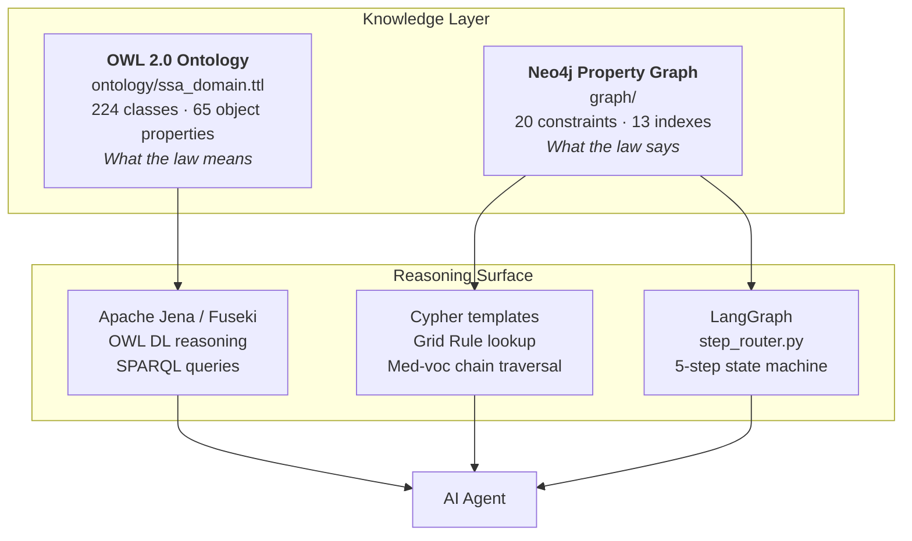
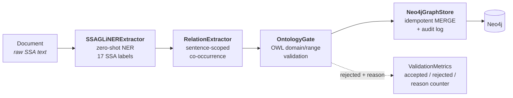
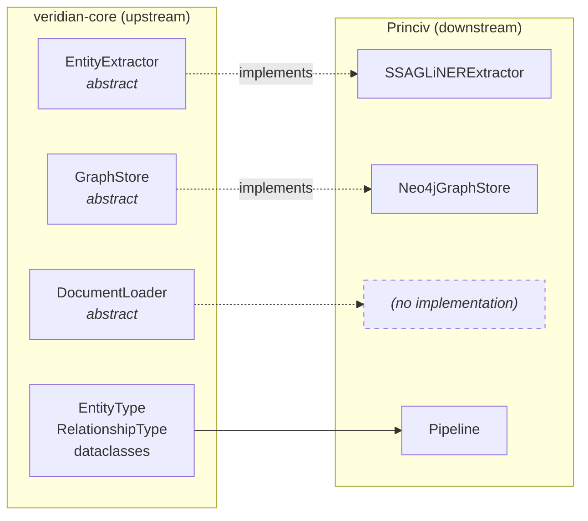
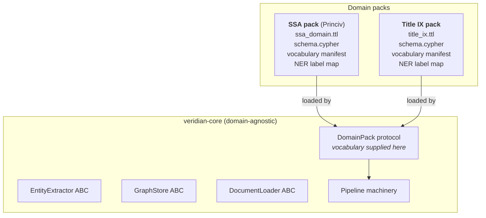

# Technical Briefing — Princiv & Veridian Core

**Status:** Current as of `Princiv@ba7752c` / `veridian-core@7f90504`
**Audience:** Project owner; future contributors; anyone picking this codebase up cold
**Purpose:** A complete account of what has been built, why it was built that way, how the two components relate, and what remains

---

## How to read this document

This is the reference document for the project regroup. It is deliberately exhaustive — it exists so that no future decision has to be made from memory.

- **Parts I–III** describe what exists, component by component.
- **Part IV** describes how the two repositories connect — and where that connection has broken.
- **Part V** records *why* the architecture is shaped the way it is. This is the section most likely to be lost otherwise.
- **Part VI** addresses the platform ambition (Title IX and beyond) and the specific gap between that ambition and today's code.
- **Parts VII–VIII** reconstruct the original plan and catalogue accumulated debt.

Every factual claim carries a `file:line` citation or a verifiable count. Where this document describes something that does **not** yet exist, it is explicitly labelled as such.

---

## Executive summary

Princiv is a **legal context engine**: it models a body of regulated law as structured, queryable knowledge so that AI agents can reason about legal constraints without hallucinating them. The current domain is SSA disability adjudication (SSI/SSDI).

The system is two repositories:

| Repository | Role | Size | State |
|---|---|---|---|
| **Princiv** | Domain knowledge + application logic | ~9,000 lines | Substantially built |
| **Veridian Core** | Reusable ingestion/storage abstractions | ~473 lines | Interfaces only |

**What genuinely works today:**

- A 1,961-line OWL 2.0 ontology with **224 classes, 65 object properties, 34 datatype properties, 10 cardinality restrictions** across 20 documented sections
- A Neo4j schema with **20 uniqueness constraints, 4 existence constraints, 3 full-text indexes, 13 property indexes** including a 4-factor composite index for Grid Rule lookups
- **2,732 lines of seed data** across four Cypher loaders covering the SSA five-step evaluation, Grid Rules, DOT occupations, medical listings, and regulatory content
- A four-stage NLP ingestion pipeline (extract → relate → validate → load) with **13 passing tests**, including verified >90% entity extraction recall
- **105 tests total** across four test files
- Apache Jena/Fuseki tooling for OWL reasoning and SPARQL validation

**The three findings that matter most:**

1. **Veridian Core cannot currently do the job it exists to do.** It is intended as a reusable substrate for compliance-heavy applications — Title IX case management is the named next target. But its entity vocabulary is hardcoded SSA terminology. Serving a second domain would require editing the library itself, which is the opposite of pluggable. This is the single most important architectural gap.

2. **The two repositories have drifted apart with nothing to catch it.** Veridian Core's enums are a hand-maintained mirror of Princiv's schema and ontology. There is no test, no code generation, and no CI enforcing the mirror. It has already broken in **roughly fifteen distinct ways**, including one bug that causes 100% silent rejection of a relationship type the extractor actively produces.

3. **The foundational seed data is from an abandoned domain.** `graph/seed_data/load_seed_data.cypher` (597 lines) is entirely California contract law. Thirty of the thirty-seven validation queries test that domain. SSDI content was added *alongside* it rather than replacing it.

None of these are fatal. All are cheaper to fix now than later. Part VIII prioritises them.

---

# Part I — What the system is

## The problem

General-purpose language models reason about law badly in ways that are difficult to detect. They fabricate citations, conflate superseded and current versions of a regulation, miss that a rule is defeasible, and cannot reliably distinguish binding authority from persuasive commentary. In a regulated domain, a confident wrong answer is worse than no answer.

Retrieval-augmented generation helps but does not solve this. Retrieval surfaces *text*; it does not surface *structure*. It cannot tell you that Step 3 of the sequential evaluation terminates the analysis when a Listing is met, that a Grid Rule is a rebuttable presumption rather than a conclusive one, or that the version of Listing 1.04 governing a claim depends on the claim's filing date rather than today's date.

Princiv's premise: **model the law as structured knowledge, not as retrievable text.** Encode the authority hierarchy, the decision procedure, the temporal versioning, and the rule types explicitly — then let agents query that structure.

## The two-layer knowledge architecture

Princiv holds legal knowledge in two complementary stores. This is the project's defining architectural decision and it is deliberate.



**The ontology answers questions about meaning and validity.** Is this a valid claim? Does this authority bind this adjudicator? Is this rule defeasible? Which version governs a claim filed in 2019? It supports classification and inference — a reasoner can derive that something *is* a severe impairment from its properties.

**The graph answers questions about facts and connections.** Which cases cite this statute? Which occupations are compatible with a sedentary RFC? Which Grid Rule applies to a 55-year-old with limited education and no transferable skills? It supports fast traversal and pattern matching.

Neither store alone is sufficient. An OWL reasoner traversing thousands of citation edges is impractically slow; a property graph cannot express cardinality restrictions or derive subclass membership.

---

# Part II — Princiv component inventory

## `ontology/` — the formal model

### `ssa_domain.ttl` (1,961 lines)

The OWL 2.0 ontology. Namespace `http://ssa.gov/disability/ontology#`, version 2.0. It integrates four external vocabularies:

| Prefix | Standard | Purpose |
|---|---|---|
| `lkif:` | LKIF-Core (Estrella) | Legal norms, processes, roles |
| `frbr:` | FRBR | Work/expression/manifestation for documents |
| `akn:` | Akoma Ntoso | Legislative document structure |
| `sali:` | SALI | Matter classification, area-of-law taxonomy |

Plus `time:` (OWL-Time) for temporal intervals, `dct:` and `skos:` for metadata.

**Declaration counts (verified):**

| Construct | Count |
|---|---|
| `owl:Class` | 224 |
| `owl:ObjectProperty` | 65 |
| `owl:DatatypeProperty` | 34 |
| `owl:AnnotationProperty` | 4 |
| `owl:Restriction` | 10 |
| `owl:equivalentClass` | 3 |

**Section map.** The file is organised into twenty banner-delimited sections:

| Line | Section | What it models |
|---|---|---|
| 21 | Upper Level Classes | `LegalEntity`, `Agent`, `Document`, `Event`, `Concept`, `TemporalEntity` |
| 54 | Documentary Layer | Authority hierarchy + temporal versioning |
| 197 | Normative Layer | Sequential evaluation, rule types, Grid Rules, Listings |
| 415 | Residual Functional Capacity | Exertional/non-exertional RFC, frequency levels |
| 568 | Evidence Hierarchy | Source types, weighting, pre/post-2017 rules |
| 737 | Foundational Layer | SSI vs SSDI distinction, deeming sub-ontology |
| 873 | Agent & Role Layer | Claimant, ALJ, VE, ME, representatives |
| 952 | Appeals Architecture | Adjudicative levels, standards of review |
| 1030 | Procedural Layer | Deadlines, exhaustion, good-cause exceptions |
| 1092 | Temporal & Event Modeling | Onset dates, waiting period, DLI |
| 1150 | Vocational Classification | Age categories, education, skill levels |
| 1261 | Disability Findings | Determinations and outcomes |
| 1312 | Epistemic States | Established vs contested fact, credibility |
| 1359 | Medical Impairments | Body systems, listing categories |
| 1478 | Childhood Disability | Six functional domains, limitation levels |
| 1543 | Benefit Calculations | SSDI/SSI amounts, offsets, supplementation |
| 1597 | Jurisdictional Variations | Circuit-level interpretive differences |
| 1630 | SALI Integration | Matter types, matter events |
| 1662 | Medical Findings | Clinical observations |
| 1759+ | Task 1.1.x additions | Missing classes, object properties, cardinality |

**Three modelling choices worth highlighting:**

**Authority hierarchy with explicit binding force.** The ontology encodes the descending chain `Statute → Regulation → SocialSecurityRuling → HALLEX/POMS`, with `:hasBindingForce` carrying values like `mandatory`, `binding`, `persuasive`, `internal`. This lets an agent answer "does this POMS provision override this circuit opinion?" — it does not.

**Temporal versioning as a first-class construct.** `:VersionedAuthority` → `:AuthorityVersion` with `:effectiveFrom`, `:effectiveUntil`, `:supersedes`, and `:appliesRetroactively`. This is not decoration. SSA Listings and Grid Rules change, and prior versions govern pending claims. The ontology carries a worked example: `:Listing_1_04_2014Edition` (effective 2014-02-19 to 2021-04-02) superseded by `:Listing_1_04_2021Edition`. The same pattern models the 2017 change to the treating-physician rule.

**Rule types carrying defeasibility.** `:DefeasibleRule`, `:RebuttablePresumption`, `:ConclusivePresumption` are distinct classes. `:Listing` is a subclass of `:ConclusivePresumption` — meeting a Listing mandates a finding. `:GridRule` is a subclass of `:RebuttablePresumption` — a Grid outcome can be overcome by vocational expert testimony, and `:GridRuleApplication` carries `:isRebutted` and `:deviationReason` to record when that happens.

> **Note on spelling.** The class is declared as `:ConclussivePresumption` (double-s) at `ssa_domain.ttl:255`, and `:Listing` inherits from that misspelling at `:337`. It is recorded in the debt register.

### `ontology/jena/` — reasoning infrastructure

| File | Lines | Purpose |
|---|---|---|
| `setup.sh` | 176 | Initialise a Jena TDB2 dataset and load `ssa_domain.ttl` |
| `run-reasoner.sh` | 150 | Run the OWL reasoner to materialise inferred triples (subclass, equivalentClass, disjoint axioms) |
| `fuseki-config.ttl` | 67 | Fuseki server configuration exposing a SPARQL endpoint |

### `ontology/tests/` — ontology validation

| File | Lines | Purpose |
|---|---|---|
| `consistency_check.sh` | 75 | OWL DL consistency test; probes for an available reasoner in order |
| `run_sparql_tests.sh` | 221 | CI runner: executes all ASK queries in `sparql/ask/` (each must return true), then the counting queries |

`sparql/` contains six `.rq` query files plus an `ask/` subdirectory:

- `class_hierarchy.rq` — verify the subclass structure
- `object_properties.rq` — enumerate declared object properties
- `verify_class_count.rq` / `verify_property_count.rq` — regression guards on declaration counts
- `verify_inferred_subclasses.rq` — confirm the reasoner materialised expected inferences
- `query_expansion_medical_condition_listings.rq` — the practical case: expand a medical condition to candidate Listings

---

## `graph/` — the property graph layer

### `schema.cypher` (163 lines)

Constraints and indexes. Organised in two blocks: an original block, and a block added under Task 1.2.1/1.2.2 for the SSDI domain.

| Category | Count | Examples |
|---|---|---|
| Uniqueness constraints | 20 | `case_id_unique`, `grid_rule_id_unique`, `listing_id_unique` |
| Existence constraints | 4 | `case_citation_required`, `source_type_required` |
| Full-text indexes | 3 | `case_fulltext_index` on title/summary/holding |
| Property indexes | 13 | `occupation_dot_code_index`, `medical_condition_icd10_index` |

**Twenty-one distinct node labels** appear across these declarations:

`Case`, `Claimant`, `Court`, `CourtCase`, `EvaluationOutcome`, `EvaluationStep`, `EvidenceType`, `FunctionalLimitation`, `GridRule`, `Jurisdiction`, `LegalConcept`, `LegalSource`, `Listing`, `Matter`, `MedicalCondition`, `Occupation`, `RFCComponent`, `Regulation`, `SSR`, `Statute`, `User`

The composite index deserves specific mention:

```cypher
CREATE INDEX grid_rule_step5_composite_index IF NOT EXISTS
FOR (gr:GridRule) ON (gr.rfc_level, gr.age_category, gr.education, gr.work_experience);
```

Grid Rule lookup is a four-factor exact match — the Medical-Vocational Guidelines are literally a lookup table keyed on RFC level, age category, education, and work experience. A composite index over exactly those four properties turns the flagship Step 5 query into a single index seek. This is the right index for the access pattern, and the file documents the `EXPLAIN` rationale inline.

### `seed_data/` — 2,732 lines across four loaders

| File | Lines | Statements | Node labels created | Relationship types created |
|---|---|---|---|---|
| `load_seed_data.cypher` | 597 | 74 | `Case`, `Court`, `Jurisdiction`, `LegalConcept`, `Statute` | `ADDRESSES`, `CITES`, `DECIDED_BY`, `DISTINGUISHES`, `INTERPRETS`, `OVERRULES`, `SUBCONCEPT_OF` |
| `load_evaluation_steps.cypher` | 203 | 19 | `EvaluationStep`, `EvaluationOutcome` | `IF_YES_GO_TO`, `IF_NO_GO_TO` |
| `load_grid_rules_and_occupations.cypher` | 559 | 63 | `DOTOccupation`, `EvaluationOutcome`, `GridRule`, `WorkLevel` | `COMPATIBLE_WITH_JOBS`, `GOVERNS`, `RESULTS_IN`, `RESULTS_IN_DECISION` |
| `load_mvp_regulatory_content.cypher` | 1,373 | 171 | `EvaluationOutcome`, `EvidenceType`, `FunctionalLimitation`, `GridRule`, `Listing`, `MedicalCondition`, `RFCComponent`, `Regulation`, `SSR`, `WorkLevel` | `CAUSES_LIMITATION`, `DETERMINES_WORK_LEVEL`, `GOVERNS`, `INTERPRETS`, `MAPS_TO_RFC`, `MAY_MEET_LISTING`, `REQUIRES_EVIDENCE`, `RESULTS_IN`, `SUPERSEDES` |

> **`load_seed_data.cypher` is California contract law.** Its cases are `Donovan v. RRL Corp.`, `Carboni v. Arrospide`, `Armendariz v. Foundation Health Psychcare`, `Discover Bank v. Superior Court`, `AT&T Mobility LLC v. Concepcion`, `Edwards v. Arthur Andersen`, `PG&E v. G.W. Thomas Drayage`. Its legal concepts are contract formation, acceptance, consideration, unconscionability. This is the file `CLAUDE.md` documents as producing the expected baseline state ("13 LegalSource nodes, 5 Courts, 13 LegalConcepts"). It was the original scaffold and was never migrated. See Part VIII.

**The five-step evaluation as a graph state machine.** `load_evaluation_steps.cypher` encodes the sequential evaluation as nodes connected by `IF_YES_GO_TO` / `IF_NO_GO_TO` edges terminating at `EvaluationOutcome` nodes. This is what makes the decision procedure *queryable* rather than hardcoded in application logic — the traversal in `step_router.py` reads the procedure from the graph rather than embedding it.

**The medical-vocational chain.** `load_mvp_regulatory_content.cypher` builds the path that connects a diagnosis to a disability determination:

```
MedicalCondition
    -[:CAUSES_LIMITATION]->    FunctionalLimitation
    -[:MAPS_TO_RFC]->          RFCComponent
    -[:DETERMINES_WORK_LEVEL]->WorkLevel
    -[:GOVERNS]->              GridRule
    -[:RESULTS_IN_DECISION]->  EvaluationOutcome
```

This five-hop path is the analytical core of Steps 3 through 5.

### `validation_queries.cypher` (490 lines, 37 queries)

Described in `CLAUDE.md` as "the de facto test suite." Each query carries an expected result count in a comment.

**Queries 1–30 test contract law** — "Find all California Supreme Court cases", "Find all cases addressing contract formation", full-text search for "unconscionable" and "mutual consent". **Queries 31–37 test the SSDI domain** — EvaluationStep counts, five-step path traversal, branching edge verification.

### `cypher_templates.py` (124 lines)

Parameterised query templates for the Neo4j Python driver.

| Template | Parameters | Returns |
|---|---|---|
| `GRID_RULE_LOOKUP` | `rfc_level`, `age_category`, `education`, `work_experience` | `rule_number`, `decision`, `outcome`, `cfr_cite` |
| `STEP5_OTHER_WORK` | `work_level_id`, `max_svp` | DOT occupations compatible with a work level |
| `STEP5_VIA_RFC` | `rfc_component_id`, `max_svp` | Same, traversing from an RFC component |
| `MEDEVOC_CHAIN` | `condition_id` | Full five-hop chain from condition to outcome |

Plus `RFC_TO_WORK_LEVEL_ID` and its inverse — bidirectional maps between RFC level names and `WorkLevel` node ids.

The module docstring documents the controlled vocabulary for Grid Rule properties (`rfc_level`, `age_category`, `education`, `work_experience` and their permitted values), which is the closest thing the project has to a written data dictionary.

### `step_router.py` (125 lines)

A LangGraph node that walks the sequential evaluation.

`EvaluationState` is a `TypedDict` with: `active_step`, `answer` (`"yes"`/`"no"`), `step_name`, `step_question`, `disposition`, `outcome_label`, `is_terminal`.

`build_step_router(driver)` returns a closure bound to a Neo4j driver. Given a state, it selects `IF_YES_GO_TO` or `IF_NO_GO_TO`, runs a single-hop traversal, and returns a **partial** state dict — matching LangGraph's merge semantics. It detects termination by checking whether the target node carries the `EvaluationOutcome` label.

Error handling is explicit: `ValueError` for missing `active_step` or an answer outside `{yes, no}`; `LookupError` when no matching edge exists, with a message pointing at the likely cause (evaluation graph not loaded).

### `graph/tests/` — 105 tests across 4 files

| File | Lines | Tests | Requires live Neo4j |
|---|---|---|---|
| `test_evaluation_steps.py` | 364 | 15 | Partially — unit tests use a mock driver and always run |
| `test_grid_rules_and_occupations.py` | 394 | 39 | Yes — auto-skips if unreachable |
| `test_mvp_regulatory_content.py` | 566 | 38 | Yes — auto-skips if unreachable |
| `test_pipeline_integration.py` | 452 | 13 | No — mocks throughout; skips only the GLiNER recall test |

Connection parameters come from `NEO4J_URI` / `NEO4J_USER` / `NEO4J_PASS` environment variables with sensible defaults. The auto-skip pattern means a developer without Neo4j running still gets a green suite for everything that does not need it — a good choice for a solo project, though it does mean the suite can pass while testing very little.

---

## `ingestion/` — the NLP extraction pipeline

Added under Task 1.7. Four stages, each in its own package.



### `extractors/ssa_gliner_extractor.py` (144 lines)

Implements Veridian Core's `EntityExtractor` ABC. Uses **GLiNER** — a zero-shot named-entity recogniser that takes entity type names as natural-language prompts rather than requiring a trained label set.

`_SSA_NER_LABELS` supplies 17 prompt strings matching `rdfs:label` values from the ontology ("Medical Condition", "Listing of Impairments", "Grid Rule", "Social Security Ruling"…). `_LABEL_TO_ENTITY_TYPE` maps 19 keys — the 17 prompts plus alternate surface forms — down to `EntityType` members.

The model loads lazily via `@cached_property`, so importing the module does not trigger a multi-hundred-megabyte download. Model checkpoint and confidence threshold are constructor arguments, so a fine-tuned model can be substituted without touching the class.

Entity ids are generated by `_normalize_id`: lowercase, non-alphanumerics collapsed to underscores, prefixed with the entity type. Duplicates within a document are dropped.

### `extractors/relation_extractor.py` (95 lines)

Turns entity lists into `(subject, predicate, object)` triples.

spaCy provides sentence segmentation only — `en_core_web_sm` loaded with `ner` and `textcat` disabled, cached via `functools.lru_cache`. Within each sentence, entity pairs are matched against `_PREDICATE_MAP`, a dictionary keyed on `(subject_type, object_type)` and derived from the OWL domain/range axioms added under Task 1.1.2. If a pair matches in reverse order, subject and object are swapped. Unrecognised pairs are skipped silently.

This is deliberately simple. It will not catch cross-sentence relations, and it assigns at most one predicate per ordered type pair. That is an acceptable trade for auditability at this stage — every emitted triple traces to an explicit map entry.

### `validators/ontology_gate.py` (200 lines)

The correctness gate. Loads `ssa_domain.ttl` once at construction with rdflib and builds four indexes: declared classes, declared object properties, `rdfs:domain` axioms, `rdfs:range` axioms. Per-triple validation is then O(1) dictionary lookups.

Five checks per triple:

1. Predicate is a declared `owl:ObjectProperty`
2. Subject entity type is a declared `owl:Class`
3. Object entity type is a declared `owl:Class`
4. Subject type satisfies the property's `rdfs:domain`
5. Object type satisfies the property's `rdfs:range`

Domain and range checks walk `rdfs:subClassOf` and `owl:equivalentClass` so that, for example, `MedicalCondition` satisfies a domain declared as `Impairment` — the two are declared equivalent. `_resolve_class_node` handles `owl:unionOf` blank nodes, which the ontology uses for properties with multiple permitted domains.

Four graph-schema predicates (`CITES`, `ADDRESSES`, `DECIDED_BY`, `SUBCONCEPT_OF`) bypass OWL checks via an allowlist, because they exist in the property graph but were never declared as OWL object properties.

Output is a `ValidationResult` carrying accepted triples, rejected triples with reasons, and a `ValidationMetrics` object with `accepted_count`, `rejected_count`, and a `Counter` of rejection reasons.

### `loaders/neo4j_loader.py` (197 lines)

Implements Veridian Core's `GraphStore` ABC against Neo4j, async throughout.

All writes use `MERGE` with `ON CREATE SET` / `ON MATCH SET`, making ingestion idempotent — re-running the pipeline over the same document produces no duplicates. `upsert_batch` opens an explicit transaction, writes all nodes before any relationships (so endpoints exist), and rolls back on any exception.

Every write emits a structured JSON audit record via the standard `logging` module: `{action, label, entity_id, created, ts}`. No new infrastructure; redirect the logger to get an audit trail.

Node labels pass through `_safe_label` before Cypher interpolation, checking membership in the `EntityType` enum.

> Both the label guard and the `WriteResult.created` reporting have implementation defects. See Part VIII.

### `pipeline.py` (149 lines)

Orchestrates the four stages. `Pipeline.run(documents)` loops over documents, calls `extract_async`, runs relation extraction, validates, converts accepted output into `GraphNode` / `GraphRelationship` objects, and batch-writes. Returns a `PipelineResult` aggregating counts and validation metrics across all documents.

Two module-level helpers do the conversion: `_entities_to_nodes` (deduplicates by id, strips `id` from the properties dict since it is set by MERGE) and `_relationships_to_graph_rels` (resolves entity references to labels, skipping any relationship whose endpoints are missing).

Rejected triples are logged at `WARNING` with the reason counter attached, and — importantly — never reach the store.

---

# Part III — Veridian Core component inventory

473 lines of Python across 8 files. **Zero runtime dependencies** — standard library only.

```
veridian-core/
├── README.md              124 lines
├── pyproject.toml          16 lines
└── layers/
    ├── __init__.py          0 lines  (empty)
    ├── ingestion/
    │   ├── __init__.py     36   re-exports 10 symbols
    │   ├── types.py       119   enums + 5 dataclasses
    │   ├── base.py         56   EntityExtractor ABC
    │   ├── document_loader.py  32   DocumentLoader ABC
    │   └── registry.py     59   ExtractorRegistry
    └── storage/
        ├── __init__.py     10
        ├── types.py        70   4 dataclasses
        └── base.py         75   GraphStore ABC
```

## `layers/ingestion/`

### `types.py` — the vocabulary and data contracts

**`EntityType(str, Enum)` — 17 members.** Subclassing `str` means members are usable directly as Cypher labels via `.value`.

| Group | Members |
|---|---|
| Graph schema types (6) | `CASE`, `STATUTE`, `REGULATION`, `COURT`, `JURISDICTION`, `LEGAL_CONCEPT` |
| SSDI domain types (11) | `MEDICAL_CONDITION`, `LISTING`, `GRID_RULE`, `SSR`, `RFC_COMPONENT`, `OCCUPATION`, `EVALUATION_STEP`, `FUNCTIONAL_LIMITATION`, `CLAIMANT`, `COURT_CASE`, `EVIDENCE_TYPE` |

**`RelationshipType(str, Enum)` — 15 members.**

| Group | Members |
|---|---|
| Graph schema (4) | `CITES`, `ADDRESSES`, `DECIDED_BY`, `SUBCONCEPT_OF` |
| Ontology (11) | `CAUSES_SYMPTOM`, `RESULTS_IN_LIMITATION`, `MAY_MEET_LISTING`, `REQUIRES_EVIDENCE`, `AFFECTS_RFC_COMPONENT`, `RESTRICTS_TO_WORK_LEVEL`, `COMPATIBLE_WITH_JOBS`, `RESULTS_IN_DECISION`, `IF_YES_GO_TO`, `IF_NO_GO_TO`, `PROTECTED_BY` |

**Five dataclasses:** `SourceSpan` (character offsets), `ExtractedEntity` (type + properties + confidence + optional span), `ExtractedRelationship` (type + source/target refs + properties + confidence), `Document` (content + source type + metadata), `ExtractionResult` (extractor id + document + entities + relationships + metadata).

### `base.py` — `EntityExtractor` ABC

Three abstract members (`extractor_id`, `supported_entity_types`, `extract`) and two concrete ones.

`extract_async` is the notable piece: it defaults to running the synchronous `extract` in the default thread-pool executor, so a purely synchronous extractor works unmodified in an async pipeline. An LLM-backed extractor overrides it. This lets rule-based, model-based, and API-based extractors coexist behind one interface.

### `document_loader.py` — `DocumentLoader` ABC

Abstract `source_type` and `load`; concrete `load_many`. **Currently has no implementations and no callers anywhere in either repository.**

### `registry.py` — `ExtractorRegistry`

Register/replace/get/`for_entity_type`/`all`, plus `__len__` and `__contains__`. `register` raises `ValueError` on duplicate ids; `replace` overwrites silently. **Currently never instantiated anywhere.**

## `layers/storage/`

### `types.py`

`GraphNode` (label, id, properties), `GraphRelationship` (type, source id/label, target id/label, properties), `WriteResult` (created flag, entity id), `BatchWriteResult` (four counters plus a `total_writes` property).

Note that `GraphNode.label` and `GraphRelationship.relationship_type` are plain `str`, not the enums. The storage layer imports nothing from the ingestion layer — a deliberate decoupling that keeps the two independently usable, at the cost of losing type protection at the storage boundary.

### `base.py` — `GraphStore` ABC

Five abstract async methods (`upsert_node`, `upsert_relationship`, `upsert_batch`, `get_node`, `close`) plus concrete `__aenter__` / `__aexit__`.

The documented contract is explicit and worth quoting, because the Princiv implementation does not fully honour it:

- `upsert_batch` — *"Atomically upsert nodes then relationships in a single transaction"*
- `upsert_relationship` — *"Both endpoint nodes must already exist. **Raises if either node is absent.**"*
- `WriteResult` — *"indicating whether the node was newly created"*

## `pyproject.toml`

```toml
[project]
name = "veridian-core"
version = "0.1.0"
description = "Legal entity extraction and ingestion layer for the Princiv Legal Context Engine"
requires-python = ">=3.11"
dependencies = []

[project.optional-dependencies]
dev = ["pytest>=8.0", "pytest-asyncio>=0.23"]

[tool.pytest.ini_options]
asyncio_mode = "auto"
testpaths = ["tests"]
```

`testpaths` points at a `tests/` directory that does not exist. **There are zero tests in this repository.**

---

# Part IV — How the two components work together

## The intended relationship

Veridian Core defines *how* legal knowledge gets into a graph. Princiv defines *what* the knowledge is. Veridian Core is upstream; Princiv depends on it; the dependency is one-directional.



## The actual import surface

Four Princiv production modules plus one test module import from Veridian Core:

| Princiv module | Imports |
|---|---|
| `ingestion/pipeline.py` | `Document`; `GraphNode`, `GraphRelationship` |
| `ingestion/loaders/neo4j_loader.py` | `EntityType`; `BatchWriteResult`, `GraphNode`, `GraphRelationship`, `GraphStore`, `WriteResult` |
| `ingestion/extractors/ssa_gliner_extractor.py` | `Document`, `EntityType`, `ExtractionResult`, `ExtractedEntity`, `SourceSpan`, `EntityExtractor` |
| `ingestion/extractors/relation_extractor.py` | `EntityType`, `ExtractionResult`, `ExtractedRelationship`, `RelationshipType` |
| `ingestion/validators/ontology_gate.py` | `ExtractionResult`, `ExtractedRelationship` |

Both concrete implementations of Veridian Core's ABCs live in Princiv, not in Veridian Core.

## The coupling mechanism — and the inversion

**In code, Veridian Core depends on nothing.** It imports only from the standard library.

**In meaning, Veridian Core depends entirely on Princiv.** Its `EntityType` and `RelationshipType` enums are a hand-maintained mirror of `graph/schema.cypher` labels and `ssa_domain.ttl` classes. Its own source says so:

- `pyproject.toml:4` — *"…for the Princiv Legal Context Engine"*
- `layers/ingestion/types.py:4-5` — *"Entity types mirror the Princiv knowledge graph schema (`graph/schema.cypher`) and OWL ontology (`ontology/ssa_domain.ttl`)"*
- `layers/storage/types.py:22-23` — *"must match the id property enforced by the uniqueness constraints in `graph/schema.cypher`"*

A library that names its consumer's file paths in its own docstrings is not independent of that consumer.

**Nothing enforces the mirror.** No test, no code generation, no CI. It is maintained by hand and by memory, and it has already drifted substantially. Part VIII catalogues the drift.

There is a second, subtler coupling: `_enum_to_owl_local` in `ontology_gate.py:57-60` encodes an undocumented naming convention bridging Veridian Core's `SCREAMING_SNAKE_CASE` enum values to the ontology's `camelCase` OWL local names. That convention exists in one four-line function in Princiv, is documented nowhere, and is already wrong for one member.

## How Veridian Core is installed

It is not declared as a dependency. `requirements.txt` lines 10–14 are **commented out**:

```
# veridian-core ingestion/storage abstractions
# Install separately during development:
#   pip install -e path/to/veridian-core
```

Consequences: `pip install -r requirements.txt` produces an environment where `import layers` fails and every module in `ingestion/` is unimportable. There is no version pinning. The commented install hint points at a feature branch rather than `main` or a tag. Resolution depends on the three-line `conftest.py` manipulating `sys.path` and on ambient environment state rather than on package metadata.

The package is also imported as top-level `layers` — a very generic name with real collision risk on `sys.path`.

---

# Part V — Architectural decisions and rationale

This section records *why*. These are the decisions most likely to be lost, second-guessed, or accidentally reversed.

### Why both an OWL ontology and a property graph

Considered: OWL only, Neo4j only, or both.

OWL alone cannot traverse large citation networks at acceptable speed, and tooling for application development against a triplestore is thinner. Neo4j alone cannot express cardinality restrictions, class equivalence, or derive subclass membership through inference — and those are exactly what encodes legal *meaning* as opposed to legal *facts*.

Chosen: both, with a clear division. Ontology owns meaning, validity, and inference. Graph owns facts, connections, and fast traversal. The cost is genuine — two stores to keep synchronised, and the `OntologyGate` exists specifically to enforce that the graph never accepts anything the ontology would reject.

### Why the ontology validates before Neo4j rather than after

The gate sits between relation extraction and the loader. Nothing invalid ever enters the database.

The alternative — write everything, validate periodically, clean up — is easier to build but produces a graph that is untrustworthy between validation runs. For a system whose entire value proposition is that agents can rely on its output, a permanently-valid store is worth the up-front cost. It also makes rejection observable at the point of failure, with a reason attached, rather than discovered later by a sweep.

### Why abstractions upstream, implementations downstream

Both concrete classes (`SSAGLiNERExtractor`, `Neo4jGraphStore`) live in Princiv while their ABCs live in Veridian Core.

This keeps Veridian Core dependency-free. Neo4j, GLiNER, spaCy, torch, and rdflib are all Princiv dependencies; Veridian Core needs none of them. A future consumer that wants a different store or a different extraction strategy takes on only the dependencies it actually uses. The trade is that Veridian Core's contracts are unverified upstream — there is no reference implementation to test them against, and no in-memory `GraphStore` to test consumers without a live database.

### Why GLiNER zero-shot rather than a fine-tuned model

GLiNER takes entity type names as natural-language prompts. Supplying the ontology's own `rdfs:label` values as prompts means the extractor's vocabulary is derived from the ontology rather than maintained separately.

This works immediately with no training data and no annotation effort — decisive for a solo project. Recall is lower than a fine-tuned model would achieve, but measured recall already exceeds the 90% acceptance threshold on the 20-document test set. The class takes `model_name` as a constructor argument, so a fine-tuned checkpoint drops in later without any structural change.

### Why sentence-scoped co-occurrence for relation extraction

The alternatives were a dependency-parse-based approach or an LLM extraction call.

Sentence-scoped co-occurrence against an explicit `(subject_type, object_type) → predicate` map is far simpler and fully auditable — every emitted triple traces to a visible map entry derived from an OWL axiom. It misses cross-sentence relations. Given that the ontology gate will reject anything structurally wrong downstream, precision matters more than recall here, and the simple approach is high-precision by construction.

### Why the five-step evaluation lives in the graph rather than in code

`load_evaluation_steps.cypher` encodes the sequential evaluation as nodes and `IF_YES_GO_TO` / `IF_NO_GO_TO` edges. `step_router.py` reads that structure at runtime.

The procedure could have been a Python state machine in a fraction of the lines. Putting it in the graph means the decision procedure is *data* — queryable, versionable, auditable, and explainable to a user by traversal. When SSA changes the procedure, that is a data migration rather than a code change. It also means an agent can answer "why did we end up at Step 5?" by replaying the path.

### Why LangGraph

`step_router.py` returns partial state dicts matching LangGraph's merge semantics, and `build_step_router` is a driver-bound closure that plugs in as a node.

The sequential evaluation is inherently a stateful, branching, human-in-the-loop workflow — exactly LangGraph's shape. Building the orchestration by hand would have meant reimplementing state merging, checkpointing, and interruption.

### Why MERGE everywhere

Every write is `MERGE` with `ON CREATE SET` / `ON MATCH SET`, so re-running ingestion over the same source is a no-op rather than a duplication.

Document ingestion is inherently re-run — sources get reprocessed after extractor improvements, after schema changes, after failures. Idempotency by construction removes an entire class of data-quality problems.

### Why structured JSON audit logging via stdlib `logging`

Every write emits `{action, label, entity_id, created, ts}`.

Legal applications need provenance. Using the standard logging module means no new infrastructure and no new dependency — redirect the logger to a file or an aggregator and the audit trail follows. The alternative (an audit table in Neo4j) would have doubled write volume for data that is rarely queried transactionally.

---

# Part VI — The platform ambition and the gap

## The intent

Veridian Core exists to be reusable. The stated goal is to plug it into other compliance-heavy applications — the named next target is **Title IX case management for public school districts and higher education institutions**. Princiv is the first application built on it, not its only reason to exist.

That is a sound thesis. The pattern Princiv implements — formal ontology, property graph, validated ingestion, procedural traversal — generalises well to any domain with a defined authority hierarchy and a structured decision procedure. Title IX fits: it has a regulatory hierarchy (statute → 34 CFR Part 106 → OCR guidance), a defined grievance procedure with steps and branch points, and evidentiary standards.

## The gap

**Veridian Core's vocabulary is hardcoded SSA terminology.**

`EntityType` contains `MEDICAL_CONDITION`, `LISTING`, `GRID_RULE`, `SSR`, `RFC_COMPONENT`. `RelationshipType` contains `MAY_MEET_LISTING`, `AFFECTS_RFC_COMPONENT`, `RESTRICTS_TO_WORK_LEVEL`. None of these mean anything in a Title IX context.

A Title IX application needs `Complainant`, `Respondent`, `FormalComplaint`, `SupportiveMeasure`, `GrievanceProcess`, `TitleIXCoordinator`, `LiveHearing`, `DeterminationOfResponsibility`. To get them, a developer would have to **edit the library itself** — adding Title IX members to an enum that also contains SSA members, in a package that both applications import.

That is the opposite of pluggable. Every new domain would enlarge a shared enum, and every application would carry every other application's vocabulary.

## What has to change

The vocabulary must become **input to** the core rather than **part of** it. The shape:



A domain pack supplies four things: an OWL ontology, a graph schema, a vocabulary manifest (the entity and relationship types, replacing the hardcoded enums), and an NER label map connecting extraction prompts to that vocabulary.

**This refactor is planned but not yet implemented.** The current code has no `DomainPack` concept. The design belongs in the Technical Design Document; the implementation is Phase 2 work.

Two things make this cheaper now than later. Veridian Core is only 473 lines, so the blast radius is small. And doing it while a *second* domain pack exists — even a deliberately tiny Title IX vocabulary with no application and no data behind it — validates the abstraction against two examples rather than one. An abstraction designed from a single example is usually wrong in ways that are invisible until the second example arrives.

---

# Part VII — Built vs. planned

The original plan was never written down as a document, but it is recoverable. Task numbers are embedded throughout the code and commit history.

## Reconstructed work breakdown

| Task | Description | Evidence | Status |
|---|---|---|---|
| **1.1.1** | Missing OWL class definitions | `ssa_domain.ttl:1759` | Complete |
| **1.1.2** | Missing object property definitions | `ssa_domain.ttl` §; cited by `relation_extractor.py:23` | Complete |
| **1.1.3** | Cardinality constraints | `ssa_domain.ttl:1908` | Complete — 10 restrictions |
| **1.2** | Abstract `GraphStore` + EntityType alignment | veridian-core commit `bbd296e` | Complete |
| **1.2.1** | SSDI uniqueness constraints | `schema.cypher:91` | Complete — 12 constraints |
| **1.2.2** | SSDI property indexes | `schema.cypher:132` | Complete — 6 indexes |
| **1.3** | — | *No reference found* | **Unknown** |
| **1.4** | MVP regulatory content | `load_mvp_regulatory_content.cypher:1140` | Complete — 1,373 lines |
| **1.5** | Grid rules and occupations | `load_grid_rules_and_occupations.cypher:5` | Complete — 559 lines |
| **1.6** | GridRule node property vocabulary | `load_grid_rules_and_occupations.cypher:2`; `cypher_templates.py:7` | Complete |
| **1.7** | NLP extraction pipeline | Multiple | Complete |
| **1.7.1** | spaCy/GLiNER with SSA entity types | commit `7e81e82` | Complete |
| **1.7.2** | Ontology validation gate | commit `d1a6ae3` | Complete |
| **1.7.3** | Wire extraction to Neo4j insert path | commit `aae21c5` | Complete |

**Task 1.3 has no reference anywhere** — not in code comments, not in commit messages, not in either repository. Either it was skipped, or it was planned and never started. Worth reconstructing from intent if the original planning notes survive anywhere.

The numbering implies a Phase 1 that is essentially complete, and by implication a Phase 2 that was never enumerated.

## What was evidently planned but never built

| Item | Evidence it was intended | Current state |
|---|---|---|
| Document loading | `DocumentLoader` ABC added under Task 1.7 | No implementations, no callers |
| Multiple extractors | `ExtractorRegistry` built to manage several | Never instantiated; `Pipeline` hardcodes one |
| In-memory `GraphStore` | `storage/types.py:5` — *"Neo4j, in-memory, etc."* | Does not exist |
| Veridian Core test suite | `pyproject.toml` configures `testpaths`, `asyncio_mode` | Directory does not exist; zero tests |
| Contract-law → SSDI migration | `CLAUDE.md:117` flags it explicitly | Not done |
| Full Grid Rule table | `ssa_domain.ttl:308` — *"Sample - would expand to full set"* | Two sample rules in the ontology |
| Fine-tuned NER model | Task 1.7.1 said *"Train or fine-tune on SSA sample documents"* | Zero-shot only |

That last row is worth noting explicitly: **Task 1.7.1 as originally specified included fine-tuning, and what was delivered was zero-shot GLiNER.** The acceptance criterion (>90% recall) was met without fine-tuning, so the substitution was reasonable — but it was a scope reduction, and it was never recorded as one.

---

# Part VIII — Debt register

Ordered by severity. Each entry gives location, impact, and blast radius.

## Severity 1 — Silently wrong

### D1. `AFFECTS_RFC_COMPONENT` is rejected 100% of the time

**Location:** `ingestion/validators/ontology_gate.py:57-60`

```python
def _enum_to_owl_local(predicate_value: str) -> str:
    parts = predicate_value.lower().split("_")
    return parts[0] + "".join(p.capitalize() for p in parts[1:])
```

`"AFFECTS_RFC_COMPONENT"` → `"affectsRfcComponent"`. The ontology declares `:affectsRFCComponent`. The lookup fails and every such triple is rejected with `undeclared_predicate`.

`relation_extractor.py:27` actively maps `(FUNCTIONAL_LIMITATION, RFC_COMPONENT)` to this predicate, so the pipeline produces triples that are guaranteed to be discarded. The `.lower()` + `.capitalize()` round-trip cannot preserve acronyms. All 14 other members round-trip correctly — this is the sole casualty.

**Impact:** A whole relationship type never reaches the graph. Visible only as a rejection count in metrics nobody is watching.

### D2. The medical-vocational chain is unreachable from ingestion

**Location:** `graph/cypher_templates.py:94-110` vs `veridian-core/layers/ingestion/types.py:40-60`

`MEDEVOC_CHAIN` traverses five hops: `CAUSES_LIMITATION → MAPS_TO_RFC → DETERMINES_WORK_LEVEL → GOVERNS → RESULTS_IN_DECISION`. **Only `RESULTS_IN_DECISION` exists in `RelationshipType`.**

Worse, two of the missing hops have near-synonyms in the enum that the extractor emits instead:

| Seed data / template uses | Extractor emits | Same node pair? |
|---|---|---|
| `CAUSES_LIMITATION` | `RESULTS_IN_LIMITATION` | Yes — `MedicalCondition → FunctionalLimitation` |
| `MAPS_TO_RFC` | `AFFECTS_RFC_COMPONENT` | Yes — `FunctionalLimitation → RFCComponent` |

**Impact:** The flagship Steps 3–5 query cannot find anything the pipeline writes. Ingested data and seeded data occupy the same graph under different edge names.

### D3. `Occupation` vs `DOTOccupation` — a three-way split

| Source | Says |
|---|---|
| `EntityType.OCCUPATION` | `"Occupation"` |
| `schema.cypher:106,142` | `Occupation` |
| Seed data (35 occurrences) | `DOTOccupation` |
| `cypher_templates.py:56,76` | `DOTOccupation` |
| Ontology | Declares **both** `:Occupation` and `:DOTOccupation` |

`ssa_gliner_extractor.py:55` maps the NER prompt `"dot occupation"` → `EntityType.OCCUPATION`, so an extracted DOT occupation is written as `:Occupation` and is invisible to every Step 5 query.

**Impact:** Extracted occupations silently do not participate in Step 5 analysis.

## Severity 2 — Structural gaps

### D4. Load-bearing labels absent from `EntityType`

| Label | Usage | Consequence |
|---|---|---|
| `WorkLevel` | 26 occurrences in seed data; central to both Step 5 templates | Un-ingestible |
| `EvaluationOutcome` | 22 occurrences; target of `RESULTS_IN_DECISION` | Un-ingestible |
| `LegalSource` | Umbrella label carrying 3 existence constraints | Unreachable — `_entities_to_nodes` emits exactly one label per node, so multi-label `:Case:LegalSource` cannot be produced |

### D5. Relationship types in data with no enum member

`CAUSES_LIMITATION`, `DETERMINES_WORK_LEVEL`, `MAPS_TO_RFC`, `GOVERNS`, `RESULTS_IN`, `INTERPRETS`, `SUPERSEDES`, `OVERRULES`, `DISTINGUISHES` — nine types created by seed loaders that the pipeline can never produce.

### D6. Enum members with no usage anywhere

`CAUSES_SYMPTOM` and `RESTRICTS_TO_WORK_LEVEL` appear in no seed data, no template, and no predicate map. Dead vocabulary.

`PROTECTED_BY`, `RESULTS_IN_LIMITATION`, and `AFFECTS_RFC_COMPONENT` are emitted by the extractor but appear in no seed data and no query — write-only edges.

### D7. `Case` vs `CourtCase` — mirror-image dead ends

Both are `EntityType` members with uniqueness constraints. Seed data uses `Case` (67 occurrences); `CourtCase` has zero. The ontology declares `:CourtCase` but has **no `:Case` class**. So `EntityType.CASE` fails the ontology gate's class check, and `EntityType.COURT_CASE` matches no real data.

### D8. Four entity types are not OWL classes

`Case`, `Court`, `Jurisdiction`, `LegalConcept` are `EntityType` members but not declared `owl:Class`. Any triple involving them should fail the gate's class check.

They currently pass — but by accident. Their predicates (`ADDRESSES`, `DECIDED_BY`) are in `_GRAPH_SCHEMA_PREDICATES`, which short-circuits at `ontology_gate.py:155` *before* the class check at `:165`. Any future non-allowlisted predicate touching these types will be silently rejected.

### D9. `GraphStore` contract violations

**Location:** `ingestion/loaders/neo4j_loader.py`

| Contract | Implementation |
|---|---|
| *"Raises if either node is absent"* (`base.py:40`) | `MATCH…MATCH…MERGE` yields zero rows; `single()` returns `None`; returns `WriteResult(created=False)`. **Silent no-op instead of a raise.** |
| `WriteResult.created` meaningful | `_UPSERT_REL:57` hardcodes `RETURN true AS created` — always `True` for relationships |
| `BatchWriteResult` four counters | Only `*_merged` ever incremented; source comment at `:60-61` admits the approximation |

### D10. `_safe_label` allowlist is effectively bypassed

**Location:** `neo4j_loader.py:33-37`

```python
if label not in _VALID_LABELS and not _SAFE_LABEL_RE.match(label):
    raise ValueError(...)
```

`_SAFE_LABEL_RE = ^[A-Za-z][A-Za-z0-9]*$` matches nearly any identifier, so the `EntityType` allowlist provides almost no protection beyond the regex. Separately, `relationship_type` is interpolated into Cypher at `:111` and `:157` with **no validation at all**.

## Severity 3 — Hygiene and legacy

### D11. Contract-law legacy

`load_seed_data.cypher` (597 lines) and validation queries 1–30 are California contract law. `CLAUDE.md:96` documents that contract-law state as the expected baseline. `CLAUDE.md:117` acknowledges the migration as outstanding.

Also: `schema.cypher` declares `Matter` and `User` constraints with no ontology class, no seed data, and no `EntityType` member.

### D12. Veridian Core has zero tests

`testpaths = ["tests"]` points at a non-existent directory. Every documented contract — MERGE idempotency, atomic batch transactions, the "raises if absent" guarantee, duplicate-id `ValueError`, the `extract_async` fallback — is unverified upstream. The `dev` extra installs pytest and pytest-asyncio for nothing.

### D13. Veridian Core is not installed as a dependency

Commented out in `requirements.txt`. No version pinning. The suggested install hint targets a merged feature branch. `pip install -r requirements.txt` yields a broken environment.

### D14. Dead code

`DocumentLoader` (added April 2026) has zero subclasses and zero imports. `ExtractorRegistry` is never instantiated — `Pipeline.__init__` hardcodes one extractor.

### D15. No CI in either repository

`.github/` is absent from both. Nothing would catch the broken `testpaths`, the enum drift, or D1.

### D16. Documentation defects

- `veridian-core/README.md` claims 13 entity types (actual: 17) and 16 relationship types (actual: 15)
- Its headline usage example overrides only `extract_async` and would raise `TypeError: Can't instantiate abstract class`
- Its architecture diagram is a `user-attachments` URL, not a committed asset — will not render in a clone or fork
- Claims MIT licence; no `LICENSE` file exists
- `CLAUDE.md` never mentions veridian-core, `layers.*`, or `ingestion/` — the entire integration is undocumented on the consumer side
- `ssa_domain.ttl:255` declares `:ConclussivePresumption` (double-s typo), inherited at `:337`
- Princiv commit `5a2d221` has the git comment template embedded in its message

---

# Part IX — Where this leaves us

## What is genuinely solid

The domain modelling is the hard part, and it is done well. A 224-class OWL ontology that correctly encodes the authority hierarchy, temporal versioning, and rule defeasibility is substantial work that would be difficult to reproduce quickly. The Neo4j schema is well-indexed for its actual access patterns. The four-stage pipeline is cleanly separated with a real correctness gate. Putting the five-step procedure in the graph rather than in code was the right call and pays off in explainability.

## What the debt actually tells us

Almost every Severity 1 and 2 item has the same root cause: **two vocabularies maintained by hand in two repositories with nothing checking they agree.**

D1 through D8 are all instances of it. They are not eight independent bugs; they are one missing mechanism producing eight symptoms. Fixing them individually would leave the mechanism absent and the drift free to resume.

This matters for sequencing. The domain-pack refactor described in Part VI is not merely a feature for enabling Title IX — it is *also* the structural fix for the drift, because a vocabulary manifest loaded from a domain pack cannot drift from itself. Combined with a conformance test that fails the build when a pack's manifest disagrees with its schema and ontology, the entire class of defect goes away.

That makes one piece of work serve two goals, which is exactly what a scope-constrained project should be looking for.

## Sizing

Roughly 9,000 lines in Princiv, 473 in Veridian Core, one contributor working with Claude Code. The original plan implied a pace that did not hold. The realistic constraint is not capability — it is that every architectural decision has to be made once, by one person, and every decision made hastily becomes debt like the fifteen items above.

The documents that follow this briefing take that seriously: they capture the full ambition so it is not lost, then sequence a deliberately narrow first slice.

---

*Companion documents: `phase-1/01-project-charter.md` onward.*
