# Project Management Plan

**Project:** Princiv — Legal Context Engine for Regulated AI Agents
**Document status:** Phase 1, Set A
**Companion documents:** [`01-project-charter.md`](01-project-charter.md) · [`02-business-case.md`](02-business-case.md) · [`../00-technical-briefing.md`](../00-technical-briefing.md)

---

## 1. Purpose

This plan governs execution of the MVP defined in the Project Charter §3.1. It exists to prevent a specific, already-observed failure: **a plan written as though capacity were unlimited, executed until the gap between plan and reality became undocumented debt.**

Accordingly this document states the real capacity figure, sizes work against it, and arrives at a duration that is honest rather than aspirational. Where an estimate is uncertain it is given as a range. Where something is assumed it is labelled an assumption.

---

## 2. Approach

### 2.1 Principles

**Sequential, never parallel.** One contributor means one workstream. Milestones do not overlap.

**Every exit criterion is objectively testable.** A command that passes, or a condition that observably holds. Never a judgement call — there is no second reviewer to arbitrate one.

**Work items must survive a gap.** At ~5 hrs/week a task may sit untouched for a week or more. Any item requiring large held context across sessions gets decomposed until it does not.

**Mechanical checking substitutes for peer review.** No independent reviewer exists, so correctness is enforced by CI, tests, and the conformance check rather than by a second pair of eyes.

**Root causes before symptoms.** The briefing's debt register shows D1–D8 are one missing mechanism producing eight symptoms. Sequencing reflects that: the mechanism is built in M2, before most symptoms are addressed in M4.

### 2.2 Cadence

| Aspect | Setting |
|---|---|
| Capacity | ~5 hrs/week, evenings |
| Session length | 1–2.5 hours, one or two sessions weekly |
| Milestone size | 8–29 hours (2–6 weeks) |
| Review point | End of each milestone |
| Documentation | Updated within the milestone that changes behaviour, never deferred |

---

## 3. Roadmap

**MVP total: 62–87 hours ≈ 12–18 weeks (3–4 months).**

Debt IDs (D1–D16) reference [`../00-technical-briefing.md`](../00-technical-briefing.md) Part VIII.

```mermaid
gantt
    title MVP Roadmap — ~5 hrs/week
    dateFormat X
    axisFormat W%s

    section M1 Foundation
    Foundation & Hygiene (13-20h)     :m1, 0, 4

    section M2 Refactor
    Domain-Pack Refactor (22-29h)     :m2, after m1, 6

    section M3 Validation
    Title IX Validation (8-12h)       :m3, after m2, 3

    section M4 Slice
    Working Vertical Slice (19-26h)   :m4, after m3, 5
```

### M1 · Foundation & Hygiene — 13–20 h · 3–4 weeks

Make the project reproducible before changing it. Nothing here alters architecture; all of it removes friction that would otherwise tax every later milestone.

| Item | Debt | Effort |
|---|---|---|
| Declare veridian-core as a real dependency; pin to a tag or SHA, not a branch | D13 | 2–3 h |
| GitHub Actions CI in both repositories — lint, test, import check | D15 | 3–5 h |
| Fix `_enum_to_owl_local` acronym handling | D1 | 1–2 h |
| Delete `load_seed_data.cypher` and validation queries 1–30; retain `schema.cypher` constraints | D11 | 2–3 h |
| Correct `CLAUDE.md` — remove the contract-law baseline; document the `ingestion/` layer and the veridian-core relationship, both currently unmentioned | D11, D16 | 3–4 h |
| Fix `veridian-core/README.md` counts, the non-running usage example, and the uncommitted diagram asset | D16 | 2–3 h |

**Exit criteria**

- `pip install -r requirements.txt` in a clean virtualenv yields an environment where `pytest` collects and runs without `PYTHONPATH` intervention
- CI runs on push in both repositories and passes
- No contract-law seed data remains; `CLAUDE.md` describes the actual post-seed state
- A test asserts that `AFFECTS_RFC_COMPONENT` maps to `affectsRFCComponent`

---

### M2 · Domain-Pack Refactor — 22–29 h · 4–6 weeks

The structural centre of the MVP. Vocabulary becomes *input to* Veridian Core rather than *part of* it — simultaneously enabling the platform claim and eliminating the drift mechanism.

| Item | Debt | Effort |
|---|---|---|
| Design the `DomainPack` protocol — ontology path, schema path, vocabulary manifest, NER label map | — | 3–4 h |
| Implement pack loading; replace hardcoded `EntityType` / `RelationshipType` | D4, D5, D6 | 5–7 h |
| Extract SSA vocabulary into a Princiv-owned pack | — | 3–4 h |
| Update the five Princiv modules that import from `layers.*` | — | 3–4 h |
| Conformance test: manifest vs `schema.cypher` vs `ssa_domain.ttl`, failing on any disagreement | D1–D8 root cause | 4–5 h |
| Establish `veridian-core/tests/`; cover every documented ABC contract | D12 | 4–5 h |

**Exit criteria**

- Searching Veridian Core for `RFC`, `Listing`, `GridRule`, `SSR`, `MedicalCondition` returns zero results outside comments and git history
- SSA vocabulary loads from a Princiv-owned pack
- Deliberately introducing a drift (add a manifest entry absent from `schema.cypher`) fails the conformance test
- `pytest` in veridian-core collects and passes a non-empty suite

**Note.** The conformance test is the single highest-leverage item in the MVP. Without it the refactor removes today's drift but not the mechanism that produced it.

---

### M3 · Title IX Validation — 8–12 h · 2–3 weeks

Test the abstraction against a second example before building further on it.

| Item | Effort |
|---|---|
| Minimal Title IX vocabulary — `Complainant`, `Respondent`, `FormalComplaint`, `SupportiveMeasure`, `GrievanceProcess`, `TitleIXCoordinator`, `LiveHearing`, `DeterminationOfResponsibility` | 3–4 h |
| Skeleton OWL ontology and graph schema sufficient for conformance | 3–4 h |
| Load the pack; run conformance; record every Veridian Core change required | 2–4 h |

**Exit criteria**

- The Title IX pack loads and passes conformance
- **Zero changes to Veridian Core were required.** Any change needed is itself the finding — it identifies remaining SSA coupling and reopens M2

**Deliberately excluded:** any Title IX application, real regulatory content, seed data, or extraction. This milestone tests pluggability only.

---

### M4 · Working Vertical Slice — 19–26 h · 4–5 weeks

Make one path work end to end.

| Item | Debt | Effort |
|---|---|---|
| Reconcile relationship vocabulary — `CAUSES_LIMITATION` vs `RESULTS_IN_LIMITATION`, `MAPS_TO_RFC` vs `AFFECTS_RFC_COMPONENT`; pick one name per edge and align seed data, templates, and manifest | D2, D5 | 5–7 h |
| Resolve `Occupation` / `DOTOccupation` | D3 | 2–3 h |
| Fix `upsert_relationship` to raise on missing endpoints; make `BatchWriteResult` counters distinguish created from merged; fix `WriteResult.created` | D9 | 3–4 h |
| Validate `relationship_type` against the manifest before Cypher interpolation; tighten `_safe_label` | D10 | 2–3 h |
| End-to-end integration test: document → extraction → validation → Neo4j → `MEDEVOC_CHAIN` result | D2 | 5–6 h |
| Remove or implement `DocumentLoader` and `ExtractorRegistry` | D14 | 2–3 h |

**Exit criteria**

- A document ingested through the pipeline produces a non-empty `MEDEVOC_CHAIN` result
- `upsert_relationship` raises on a missing endpoint
- `BatchWriteResult` distinguishes created from merged
- No dead abstractions remain — each is used or removed

---

## 4. Schedule assumptions

| # | Assumption | Effect if wrong |
|---|---|---|
| SA1 | ~5 hrs/week sustained | Calendar extends proportionally; milestone structure unaffected |
| SA2 | AI-assisted throughput ~3–5× unassisted | Effort ranges scale; milestone count unchanged |
| SA3 | Neo4j available locally for M4 | M4 blocks entirely |
| SA4 | The refactor stays within Veridian Core plus five Princiv modules | M2 grows and may need splitting |
| SA5 | No regulatory changes require ontology rework mid-MVP | Unplanned work enters scope |

### 4.1 When a week is missed

Missing a week is expected, not exceptional. The response is deliberately minimal:

1. **Do not compress.** The next milestone does not absorb the loss; the calendar moves.
2. **Record it** in the change log if two or more consecutive weeks are missed.
3. **Re-estimate at three weeks.** A three-week gap means context is gone; the current milestone gets re-estimated before resuming rather than assumed intact.

The plan has no float and no deadline. Slippage is information, not failure — the only failure mode being guarded against is *unrecorded* slippage.

---

## 5. Risk register

Reconciled against the briefing's debt register. Every Severity 1–2 debt item maps to a risk here.

| # | Risk | Prob. | Impact | Mitigation | Trigger |
|---|---|---|---|---|---|
| **R1** | **Scope creep** — the identified historical failure mode | High | High | Charter §3.2 enumerates exclusions explicitly. Change control (§6) requires a written entry plus re-approval. Additions must displace comparable work or extend the stated range | Any work begun that is not a listed milestone item |
| **R2** | Vocabulary drift resumes after the refactor | Medium | High | The M2 conformance test makes drift a build failure. Verified by deliberately introducing one | Conformance test absent or non-blocking at M2 exit |
| **R3** | The domain-pack abstraction proves wrong under the second domain | Medium | High | M3 precedes M4 specifically so this surfaces before more is built on it. Any required Veridian Core change reopens M2 | Any Veridian Core change needed during M3 |
| **R4** | Capacity interruption extends the timeline indefinitely | Medium | Medium | Documentation enables cold resumption. Milestones sized so ≤5 weeks of work is ever in flight. Three-week gap triggers re-estimation | Three consecutive weeks with no progress |
| **R5** | Legal-accuracy defects in modelled content | Medium | High | Every modelled rule carries its citation. Validation queries assert expected counts. Accepted limitation: no expert review is available | Any modelled rule without a resolvable citation |
| **R6** | M2 proves larger than estimated | Medium | Medium | Split at the pack-loading boundary: M2a mechanism, M2b SSA pack migration | M2 exceeds 29 h with exit criteria unmet |
| **R7** | Dependency churn (GLiNER, spaCy, torch) breaks the pipeline | Medium | Low | Pin versions in M1. CI surfaces breakage on push | CI fails on an unchanged working tree |
| **R8** | Single-contributor knowledge loss | Low | High | The briefing and this document set are the mitigation and are maintained as living documents | Any architectural decision made and not recorded |
| **R9** | Neo4j unavailable when M4 needs it | Low | High | Three of four test files already auto-skip. Verify availability at M3 exit, before M4 begins | Local instance unreachable at M3 exit |
| **R10** | Contract-law deletion removes something still depended on | Low | Medium | `schema.cypher` constraints are retained deliberately. Full suite run before and after deletion | Any test failing after removal |

### 5.1 Risks accepted without mitigation

Recorded honestly rather than assigned a mitigation that would not be performed:

- **No independent code review.** Mechanical checking is a partial substitute, not an equivalent one.
- **No SSA domain expert review.** Modelled rules carry citations, but nobody qualified has verified the modelling is correct.
- **Bus factor of one.** Documentation reduces the cost of an interruption; it does not eliminate it.

---

## 6. Change control

Deliberately heavier than a solo project would normally warrant. Undocumented scope expansion is the failure this regroup exists to correct, so the friction is the point.

### 6.1 What requires a change record

- Adding anything not listed as a milestone item
- Removing a committed deliverable
- Changing a milestone's exit criteria
- Any effort re-estimate exceeding its stated range
- Any architectural decision that supersedes one in the briefing or the Charter

### 6.2 Procedure

1. Append an entry to the change log (§6.3) recording **what** changed, **why**, and its **effort impact**
2. If scope grows, either displace comparable work or extend the milestone's stated effort range — never absorb it silently
3. Re-approve the affected milestone before proceeding

### 6.3 Change log

| # | Date | Change | Rationale | Effort impact | Approved |
|---|---|---|---|---|---|
| — | — | *No changes recorded* | — | — | — |

---

## 7. Definition of done

### 7.1 Task level

- Implemented and committed on a feature branch
- Tests written and passing; new behaviour has new coverage
- CI green
- Affected documentation updated in the same change
- No new debt introduced without a register entry

### 7.2 Milestone level

- Every work item complete or explicitly deferred with a change-log entry
- All exit criteria objectively verified — the command run, the condition observed
- Branch merged to `main`
- Debt register updated for anything resolved or discovered
- Sponsor approval recorded

### 7.3 MVP level

All nine Charter success criteria (S1–S9) hold.

---

## 8. Quality approach

### 8.1 During the MVP

| Mechanism | Coverage |
|---|---|
| Unit tests | Pure logic; mock-driver tests that always run |
| Integration tests | Live Neo4j; auto-skip when unavailable |
| Conformance test | Vocabulary agreement across manifest, schema, and ontology |
| Validation queries | Expected-count assertions against seeded state |
| SPARQL + consistency checks | Ontology structure and OWL DL consistency |
| CI | All of the above on push, both repositories |

**Known limitation.** Three of four Princiv test files auto-skip without Neo4j. The suite can pass while testing very little. CI must run Neo4j in a service container so this cannot happen silently — that is part of M1's CI work, not an afterthought.

### 8.2 Handoff to Phase 2

Phase 2 formalises what the MVP does informally: a Test Plan defining strategy and coverage targets, explicit Test Cases, and a Defect Tracking Log. The debt register in the briefing is the seed for that log.

---

## 9. Communication and tracking

Single contributor, so this is record-keeping rather than communication.

| Artifact | Purpose | Cadence |
|---|---|---|
| Git history | Authoritative record of what changed | Per commit |
| Milestone exit checklist | Objective completion verification | Per milestone |
| Change log (§6.3) | Scope decisions and their rationale | As needed |
| Debt register | Known defects and their status | Per milestone |
| This plan | Living document, not a snapshot | Per milestone |

**Progress is measured by exit criteria met, never by effort expended.** Hours spent is an input, not an outcome — and treating it as an outcome is part of how the original plan drifted.

---

## 10. Phase 2 preview

Listed for continuity. Not committed to, not estimated, and not started until Phase 1 is approved and the MVP is complete.

**Quality Assurance and Testing** — Test Plan (scope, strategy, environments, quality metrics) · Test Cases (explicit steps and expected results) · Defect Tracking Log (seeded from the debt register)

**Deployment and Maintenance** — Deployment Plan (release sequence, migration, rollback) · Release Notes · User Manuals & Guides

Beyond Phase 2, and outside current planning: the stable public API surface, the user interface, additional domain packs, and whichever commercialization path the decision point in [`02-business-case.md`](02-business-case.md) §7 selects.

---

## 11. Approval

| Role | Name | Date | Status |
|---|---|---|---|
| Project sponsor | Jeremy Jones | | Pending |

---

*End of Phase 1, Set A. Next set: [Business Requirements Document and Software Requirements Specification](../README.md).*
