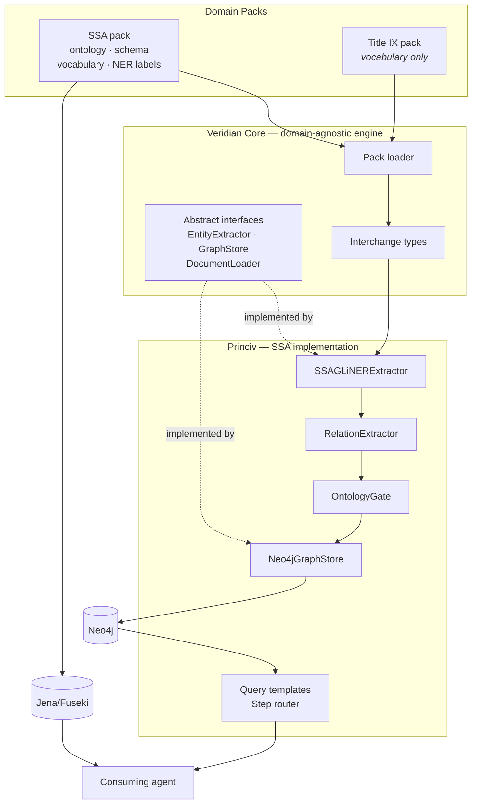

# Software Requirements Specification

**Project:** Princiv — Legal Context Engine for Regulated AI Agents
**Platform component:** Veridian Core
**Document status:** Phase 1, Set B
**Companion documents:** [`04-business-requirements-document.md`](04-business-requirements-document.md) · [`../00-technical-briefing.md`](../00-technical-briefing.md)

---

## 1. Introduction

### 1.1 Purpose

This document specifies the functional, non-functional, and interface requirements for Princiv and Veridian Core. Every functional requirement traces to a business capability in the BRD. Every requirement carries a phase tag and a current implementation status.

### 1.2 How to read a requirement

Each requirement has four attributes:

| Attribute | Values |
|---|---|
| **ID** | `FR-<SUBSYSTEM>-nn`, `NFR-nn`, or `IR-nn` |
| **Phase** | **MVP** · **P2** (Phase 2) · **Future** |
| **Status** | ✅ Implemented · ◐ Partial · ○ Not implemented · ⚠ Implemented with known defect |
| **Traces to** | BRD capability (BC-n) |

**On the Status column.** This SRS documents a system that partly exists. The status attribute makes the gap between specification and reality visible rather than implied. A requirement marked ⚠ is implemented but defective — the defect is named, with its debt ID from the briefing.

Requirement language follows RFC 2119: **SHALL** is mandatory, **SHOULD** is recommended, **MAY** is optional.

### 1.3 System context

---

## 2. Functional requirements

### 2.1 Domain modelling — `FR-ONT`

| ID | Requirement | Phase | Status | Traces |
|---|---|---|---|---|
| **FR-ONT-01** | The ontology SHALL declare an authority hierarchy in which each authority carries an explicit binding force | MVP | ✅ | BC-1 |
| **FR-ONT-02** | The ontology SHALL support temporal versioning of authorities, with effective-from and effective-until dates and explicit supersession | MVP | ✅ | BC-1 |
| **FR-ONT-03** | The ontology SHALL distinguish conclusive presumptions, rebuttable presumptions, and defeasible rules as separate classes | MVP | ✅ | BC-1 |
| **FR-ONT-04** | The ontology SHALL declare a domain and a range for every object property used in extraction | MVP | ◐ | BC-1, BC-4 |
| **FR-ONT-05** | The ontology SHALL be OWL DL consistent under a standard reasoner | MVP | ✅ | BC-1 |
| **FR-ONT-06** | The ontology SHALL model the sequential evaluation as ordered, terminating steps | MVP | ✅ | BC-1, BC-5 |
| **FR-ONT-07** | The ontology SHALL declare a class for every entity type in the active domain pack's vocabulary | MVP | ⚠ D7, D8 | BC-1, BC-9 |
| **FR-ONT-08** | The ontology SHOULD carry a citation annotation on every modelled rule | MVP | ◐ | BC-6 |
| **FR-ONT-09** | The ontology SHALL model claimant-specific case facts | Future | ○ | BC-12 |
| **FR-ONT-10** | The ontology SHALL model the childhood disability evaluation | Future | ◐ *modelled, unqueried* | BC-1 |
| **FR-ONT-11** | The ontology SHALL model benefit calculation | Future | ◐ *modelled, unqueried* | BC-1 |

> **FR-ONT-04 / FR-ONT-07 note.** The ontology declares 224 classes and 65 object properties, but four entity types in current use (`Case`, `Court`, `Jurisdiction`, `LegalConcept`) have no corresponding `owl:Class` (D8), and `Case` and `CourtCase` are mutually inconsistent between ontology and graph (D7). Closing these is M2/M4 work.

### 2.2 Knowledge storage — `FR-GRAPH`

| ID | Requirement | Phase | Status | Traces |
|---|---|---|---|---|
| **FR-GRAPH-01** | The schema SHALL enforce a uniqueness constraint on the identifier of every node label in the active pack's vocabulary | MVP | ◐ | BC-2, BC-9 |
| **FR-GRAPH-02** | The schema SHALL index every property used as a lookup key | MVP | ✅ | BC-2 |
| **FR-GRAPH-03** | The schema SHALL provide a composite index over the four vocational factors used in Grid Rule lookup | MVP | ✅ | BC-2 |
| **FR-GRAPH-04** | The schema SHALL provide full-text indexes over free-text legal content | MVP | ✅ | BC-2 |
| **FR-GRAPH-05** | The graph SHALL store the sequential evaluation as traversable nodes and branch edges | MVP | ✅ | BC-5 |
| **FR-GRAPH-06** | The graph SHALL store the medical-vocational chain as a traversable path from condition to outcome | MVP | ✅ *seeded only* | BC-5 |
| **FR-GRAPH-07** | Every stored node SHALL carry a label drawn from the active pack's vocabulary | MVP | ⚠ D4 | BC-4 |
| **FR-GRAPH-08** | The schema SHALL contain no constraints for labels absent from any pack vocabulary | MVP | ⚠ D11 *`Matter`, `User`* | BC-9 |

> **FR-GRAPH-01 note.** All 17 current entity types have uniqueness constraints, but three labels that carry real data (`WorkLevel`, `EvaluationOutcome`, `DOTOccupation`) are absent from the vocabulary entirely (D3, D4). The requirement is satisfied in one direction only.

### 2.3 Domain packs — `FR-PACK`

The MVP's structural centre. **None of this exists today** — the entire subsystem is M2 work.

| ID | Requirement | Phase | Status | Traces |
|---|---|---|---|---|
| **FR-PACK-01** | A domain pack SHALL supply four artifacts: an OWL ontology, a graph schema, a vocabulary manifest, and an extraction label map | MVP | ○ | BC-7 |
| **FR-PACK-02** | The engine SHALL load entity and relationship vocabulary from the active pack at runtime | MVP | ○ | BC-7 |
| **FR-PACK-03** | The engine SHALL contain no vocabulary specific to any single domain | MVP | ○ | BC-7 |
| **FR-PACK-04** | The system SHALL provide a conformance check verifying that a pack's vocabulary manifest, graph schema, and ontology agree | MVP | ○ | BC-9 |
| **FR-PACK-05** | A conformance failure SHALL fail the build | MVP | ○ | BC-9 |
| **FR-PACK-06** | The conformance check SHALL report every disagreement, not only the first | MVP | ○ | BC-9 |
| **FR-PACK-07** | Multiple packs SHALL be installable concurrently; exactly one SHALL be active per pipeline run | MVP | ○ | BC-7 |
| **FR-PACK-08** | Adding a pack SHALL require no modification to the engine | MVP | ○ | BC-7 |
| **FR-PACK-09** | A pack SHOULD declare the engine version it targets | P2 | ○ | BC-7 |
| **FR-PACK-10** | Packs SHALL be independently versionable and distributable | Future | ○ | BC-7 |

> **FR-PACK-04 is the highest-leverage requirement in this specification.** The briefing established that D1–D8 are one missing mechanism producing eight symptoms. This requirement is that mechanism. Without it, M2 removes today's drift but not its cause.

### 2.4 Document ingestion — `FR-ING`

| ID | Requirement | Phase | Status | Traces |
|---|---|---|---|---|
| **FR-ING-01** | The system SHALL accept a document comprising content, a source type, and arbitrary metadata | MVP | ✅ | BC-3 |
| **FR-ING-02** | The system SHALL extract typed entities, each with a confidence score and a character-offset span into the source | MVP | ✅ | BC-3, BC-6 |
| **FR-ING-03** | Extraction labels SHALL derive from the active pack rather than being hardcoded | MVP | ⚠ *hardcoded* | BC-3, BC-7 |
| **FR-ING-04** | The confidence threshold SHALL be configurable per extractor instance | MVP | ✅ | BC-3 |
| **FR-ING-05** | The extraction model SHALL be replaceable without modifying the extractor class | MVP | ✅ | BC-3 |
| **FR-ING-06** | Entities SHALL be deduplicated within a document by generated identifier | MVP | ✅ | BC-3 |
| **FR-ING-07** | The system SHALL emit (subject, predicate, object) triples with entity type annotations | MVP | ✅ | BC-3 |
| **FR-ING-08** | Relation extraction SHALL be scoped to sentence boundaries | MVP | ✅ | BC-3 |
| **FR-ING-09** | Predicate assignment SHALL derive from the active pack's declared domain/range axioms | MVP | ⚠ *hardcoded map* | BC-3, BC-7 |
| **FR-ING-10** | The system SHALL load documents from files and other sources | P2 | ○ D14 | BC-3 |
| **FR-ING-11** | The system SHALL support multiple registered extractors selected by entity type | P2 | ⚠ D14 *registry unused* | BC-3 |
| **FR-ING-12** | Extraction SHOULD support cross-sentence relations | Future | ○ | BC-3 |
| **FR-ING-13** | The system SHOULD support a fine-tuned domain extraction model | Future | ○ | BC-3 |

### 2.5 Validation — `FR-VAL`

| ID | Requirement | Phase | Status | Traces |
|---|---|---|---|---|
| **FR-VAL-01** | Every triple SHALL be validated against the active pack's ontology before storage | MVP | ✅ | BC-4 |
| **FR-VAL-02** | The validator SHALL reject any triple whose predicate is not a declared object property | MVP | ✅ | BC-4 |
| **FR-VAL-03** | The validator SHALL reject any triple whose subject or object type is not a declared class | MVP | ⚠ D8 *bypassable* | BC-4 |
| **FR-VAL-04** | The validator SHALL enforce domain axioms, resolving subclass and equivalence relationships | MVP | ✅ | BC-4 |
| **FR-VAL-05** | The validator SHALL enforce range axioms, resolving subclass and equivalence relationships | MVP | ✅ | BC-4 |
| **FR-VAL-06** | The validator SHALL resolve union-typed domain and range declarations | MVP | ✅ | BC-4 |
| **FR-VAL-07** | Predicate name translation between vocabulary and ontology SHALL preserve acronyms | MVP | ⚠ **D1** | BC-4 |
| **FR-VAL-08** | The validator SHALL emit accepted count, rejected count, and a breakdown by rejection reason | MVP | ✅ | BC-4, BC-8 |
| **FR-VAL-09** | Rejected triples SHALL NOT reach storage under any circumstance | MVP | ✅ | BC-4 |
| **FR-VAL-10** | Rejections SHALL be logged with sufficient detail to diagnose the cause | MVP | ✅ | BC-8 |
| **FR-VAL-11** | The validator SHALL load the ontology once and validate at constant per-triple cost | MVP | ✅ | BC-4 |
| **FR-VAL-12** | Predicates outside the ontology SHALL be permitted only via an explicit, pack-declared allowlist | MVP | ⚠ *hardcoded in Princiv* | BC-4, BC-7 |

> **FR-VAL-07 is the single most consequential defect in the system.** `AFFECTS_RFC_COMPONENT` converts to `affectsRfcComponent`; the ontology declares `affectsRFCComponent`. Every such triple is rejected silently, and the relation extractor actively produces them. Fixed in M1.

### 2.6 Persistence — `FR-STORE`

| ID | Requirement | Phase | Status | Traces |
|---|---|---|---|---|
| **FR-STORE-01** | All writes SHALL use merge semantics so that repeated ingestion of the same source is idempotent | MVP | ✅ | BC-3 |
| **FR-STORE-02** | Batch writes SHALL execute in a single transaction, with all nodes written before any relationship | MVP | ✅ | BC-3 |
| **FR-STORE-03** | The batch SHALL roll back entirely on any error | MVP | ✅ | BC-3 |
| **FR-STORE-04** | Writing a relationship whose endpoint is absent SHALL raise, not silently no-op | MVP | ⚠ **D9** | BC-4 |
| **FR-STORE-05** | Write results SHALL accurately distinguish records created from records merged | MVP | ⚠ **D9** | BC-8 |
| **FR-STORE-06** | Node labels and relationship types SHALL be validated against the active pack's vocabulary before use in a query | MVP | ⚠ **D10** | BC-4 |
| **FR-STORE-07** | Every write SHALL emit a structured audit record containing action, label, identifier, creation flag, and timestamp | MVP | ✅ | BC-8 |
| **FR-STORE-08** | No untyped record SHALL exist in the store after a pipeline run | MVP | ✅ | BC-4 |
| **FR-STORE-09** | The storage interface SHALL admit implementations other than Neo4j | MVP | ✅ *interface only* | BC-7 |
| **FR-STORE-10** | An in-memory store SHOULD exist for testing without a database | P2 | ○ | BC-7 |
| **FR-STORE-11** | The store SHOULD support deletion and retraction of stored knowledge | Future | ○ | BC-13 |

> **FR-STORE-06 note.** The current label guard is bypassable — its allowlist check is disjunctive with a permissive identifier regex, so nearly any identifier passes (D10). Relationship types receive no validation at all before Cypher interpolation.

### 2.7 Query and traversal — `FR-QRY`

| ID | Requirement | Phase | Status | Traces |
|---|---|---|---|---|
| **FR-QRY-01** | The system SHALL resolve a Grid Rule from the four vocational factors in a single indexed lookup | MVP | ✅ | BC-5 |
| **FR-QRY-02** | The system SHALL return occupations compatible with a given work level, filtered by skill level | MVP | ✅ | BC-5 |
| **FR-QRY-03** | The system SHALL traverse the full medical-vocational chain from condition to outcome | MVP | ✅ *seeded only* | BC-5 |
| **FR-QRY-04** | Chain traversal SHALL succeed over ingested knowledge, not only seeded knowledge | MVP | ⚠ **D2** | BC-3, BC-5 |
| **FR-QRY-05** | The system SHALL advance the sequential evaluation one step per answer, reading the procedure from the graph | MVP | ✅ | BC-5 |
| **FR-QRY-06** | Step routing SHALL return only changed state, for compatibility with external workflow orchestration | MVP | ✅ | BC-5 |
| **FR-QRY-07** | Step routing SHALL detect terminal outcomes and report the disposition | MVP | ✅ | BC-5 |
| **FR-QRY-08** | Step routing SHALL raise a diagnosable error when no branch edge exists | MVP | ✅ | BC-5 |
| **FR-QRY-09** | Every query result SHALL carry the citation of its supporting authority | MVP | ◐ | BC-6 |
| **FR-QRY-10** | The system SHALL distinguish "no applicable rule found" from "the rule does not apply" | MVP | ○ | BC-5 (BR-6) |
| **FR-QRY-11** | The system SHALL select the authority version governing a given date | P2 | ○ | BC-1 (BR-2) |
| **FR-QRY-12** | The system SHALL expose queries through a stable public interface | Future | ○ | BC-10 |

> **FR-QRY-10 note.** BR-6 in the BRD requires this distinction, and nothing currently implements it — an empty result set is returned identically whether no rule matched or the traversal found a genuine negative. Flagged as an MVP requirement with no current implementation; if it cannot be met within M4 it should move to P2 through change control rather than be silently dropped.

---

## 3. Non-functional requirements

### 3.1 Correctness

| ID | Requirement | Target | Phase | Status | Traces |
|---|---|---|---|---|---|
| **NFR-01** | Entity extraction recall on the reference document set | > 90% | MVP | ✅ *verified* | BM-1 |
| **NFR-02** | Triples with invalid entity types or predicates rejected | 100% | MVP | ⚠ D1, D8 | BM-2 |
| **NFR-03** | Untyped records in the store after a run | 0 | MVP | ✅ | BM-3 |
| **NFR-04** | Repeated ingestion of identical input produces no duplicate records | Exact | MVP | ✅ | BC-3 |
| **NFR-05** | Modelled rules lacking a resolvable citation | 0 | MVP | ◐ | BM-6 |

### 3.2 Portability

| ID | Requirement | Phase | Status | Traces |
|---|---|---|---|---|
| **NFR-06** | Adding a domain SHALL require zero changes to the engine | MVP | ○ | BM-4 |
| **NFR-07** | The engine SHALL have no runtime dependencies beyond the standard library | MVP | ✅ | BC-7 |
| **NFR-08** | The system SHALL run on Python 3.11 or later | MVP | ✅ | — |
| **NFR-09** | The engine SHALL NOT depend on any specific database, extraction model, or reasoner | MVP | ✅ | BC-7 |

### 3.3 Performance

Stated qualitatively. There are no users and therefore no basis for numeric latency targets; inventing them would be false precision. Numeric targets are deferred to Phase 2, when a Test Plan can establish a measured baseline.

| ID | Requirement | Phase | Status | Traces |
|---|---|---|---|---|
| **NFR-10** | Ontology loading SHALL occur once per process, not per validated triple | MVP | ✅ | BC-4 |
| **NFR-11** | Per-triple validation SHALL be constant-time with respect to ontology size | MVP | ✅ | BC-4 |
| **NFR-12** | Grid Rule lookup SHALL resolve via the composite index rather than a scan | MVP | ✅ | BC-5 |
| **NFR-13** | The extraction model SHALL load lazily, so that importing a module does not trigger a model download | MVP | ✅ | — |
| **NFR-14** | Numeric latency and throughput targets SHALL be established against a measured baseline | P2 | ○ | — |

### 3.4 Auditability

| ID | Requirement | Phase | Status | Traces |
|---|---|---|---|---|
| **NFR-15** | Every write SHALL be traceable to a timestamped audit record | MVP | ✅ | BC-8 |
| **NFR-16** | Audit records SHALL be machine-parseable | MVP | ✅ *JSON* | BC-8 |
| **NFR-17** | Audit output SHALL be redirectable without code changes | MVP | ✅ *stdlib logging* | BC-8 |
| **NFR-18** | Every extracted entity SHALL retain a character offset into its source document | MVP | ✅ | BC-6 |
| **NFR-19** | Rejected knowledge SHALL be recorded with its rejection reason | MVP | ✅ | BC-8 |
| **NFR-20** | Audit records SHALL be retained durably for a defined period | Future | ○ | BC-8 |

### 3.5 Maintainability and verification

| ID | Requirement | Phase | Status | Traces |
|---|---|---|---|---|
| **NFR-21** | Both repositories SHALL run automated checks on every push | MVP | ○ D15 | BG-3 |
| **NFR-22** | A clean install from declared dependencies SHALL produce a working environment | MVP | ⚠ **D13** | BG-3 |
| **NFR-23** | The engine SHALL have an automated test suite covering every documented interface contract | MVP | ○ D12 | BG-3 |
| **NFR-24** | Tests not requiring a database SHALL run without one, and SHALL report clearly when database-dependent tests are skipped | MVP | ◐ | BG-3 |
| **NFR-25** | Continuous integration SHALL run database-dependent tests against a real database instance | MVP | ○ | BG-3 |
| **NFR-26** | Architectural decisions SHALL be recorded in documentation at the time they are made | MVP | ✅ | BG-3 |
| **NFR-27** | Documentation SHALL be sufficient for a contributor to resume after an extended gap | MVP | ✅ | BCN-1, BCN-2 |
| **NFR-28** | Dependency versions SHALL be pinned | MVP | ○ | BG-3 |

> **NFR-24 / NFR-25 note.** Three of four Princiv test files auto-skip without Neo4j, which means the suite can report success while exercising very little. NFR-25 exists specifically so that CI cannot pass under those conditions — it is not an optional extra to NFR-21.

### 3.6 Legal and ethical

| ID | Requirement | Phase | Status | Traces |
|---|---|---|---|---|
| **NFR-29** | The system SHALL present output as structured legal information, never as legal advice | MVP | ✅ *no user surface* | BCN-6 |
| **NFR-30** | Modelled content SHALL derive only from publicly available sources | MVP | ✅ | BCN-5 |
| **NFR-31** | Known accuracy limitations SHALL be documented rather than implied | MVP | ✅ | BCN-4 |
| **NFR-32** | Any user-facing form SHALL carry explicit limitation disclosure | Future | ○ | BCN-6 |

---

## 4. Interface requirements

### 4.1 The engine extension contract — `IR`

These define what a consumer of Veridian Core must implement or supply.

| ID | Requirement | Phase | Status | Traces |
|---|---|---|---|---|
| **IR-01** | The engine SHALL define an abstract extractor interface requiring a stable identifier, a declaration of supported entity types, and a synchronous extraction method | MVP | ✅ | BC-3, BC-7 |
| **IR-02** | The extractor interface SHALL provide an asynchronous path that defaults to executing the synchronous implementation off the event loop | MVP | ✅ | BC-3 |
| **IR-03** | The engine SHALL define an abstract store interface with node upsert, relationship upsert, batch upsert, node retrieval, and resource release | MVP | ✅ | BC-2, BC-7 |
| **IR-04** | The store interface SHALL support use as an asynchronous context manager | MVP | ✅ | BC-2 |
| **IR-05** | The engine SHALL define an abstract document loader interface | MVP | ✅ *unimplemented* | BC-3 |
| **IR-06** | The engine SHALL define a domain pack interface specifying the four required artifacts | MVP | ○ | BC-7 |
| **IR-07** | The vocabulary manifest format SHALL be declarative and human-editable | MVP | ○ | BC-7 |
| **IR-08** | The manifest SHALL declare, for each relationship type, its permitted subject and object types | MVP | ○ | BC-4, BC-7 |
| **IR-09** | The manifest SHALL declare the mapping between vocabulary names and ontology property names explicitly, rather than deriving it by string transformation | MVP | ○ | BC-9 |
| **IR-10** | Interchange types SHALL carry no domain-specific fields | MVP | ✅ | BC-7 |
| **IR-11** | Interface contract violations SHALL be detectable by the engine's own test suite | MVP | ○ D12 | BG-3 |

> **IR-09 exists because of D1.** The current system derives ontology property names from vocabulary names by lowercasing and re-capitalising, which cannot round-trip acronyms. An explicit declared mapping removes an entire class of defect rather than patching the transformation.

### 4.2 External interfaces

| ID | Interface | Requirement | Phase | Status |
|---|---|---|---|---|
| **IR-12** | Neo4j | The system SHALL connect using configurable URI and credentials supplied by environment | MVP | ✅ |
| **IR-13** | Jena/Fuseki | The system SHALL expose the ontology through a SPARQL endpoint for reasoning and validation | MVP | ✅ |
| **IR-14** | Workflow orchestration | Step routing SHALL be usable as a node in an external state-machine framework | MVP | ✅ |
| **IR-15** | Public API | The system SHALL expose a documented, versioned interface for external consumers | Future | ○ |

---

## 5. Traceability

### 5.1 Business capability → requirements

| BRD capability | Functional requirements |
|---|---|
| **BC-1** Represent a domain formally | FR-ONT-01…08, FR-ONT-09…11 |
| **BC-2** Store facts queryably | FR-GRAPH-01…04, FR-STORE-09, IR-03, IR-04 |
| **BC-3** Convert documents to knowledge | FR-ING-01…13, FR-STORE-01…03, IR-01, IR-02, IR-05 |
| **BC-4** Reject non-conforming knowledge | FR-VAL-01…12, FR-GRAPH-07, FR-STORE-04, FR-STORE-06, FR-STORE-08 |
| **BC-5** Answer via the decision procedure | FR-QRY-01…12, FR-GRAPH-05, FR-GRAPH-06, FR-ONT-06 |
| **BC-6** Citation for every assertion | FR-ONT-08, FR-ING-02, FR-QRY-09, NFR-18 |
| **BC-7** Support additional domains | FR-PACK-01…10, NFR-06, NFR-07, NFR-09, IR-06…IR-10 |
| **BC-8** Audit record | FR-STORE-07, FR-VAL-08, FR-VAL-10, NFR-15…NFR-20 |
| **BC-9** Detect model/knowledge disagreement | FR-PACK-04…06, FR-GRAPH-08, FR-ONT-07, IR-09 |
| **BC-10** Public interface *(Future)* | FR-QRY-12, IR-15 |
| **BC-11** User interface *(Future)* | — *out of scope for Phase 1* |
| **BC-12** Case-level data *(Future)* | FR-ONT-09 |
| **BC-13** Regulatory change tracking *(Future)* | FR-STORE-11 |

### 5.2 Charter success criteria → requirements → milestone

| Charter | Requirements | Milestone |
|---|---|---|
| **S1** Clean install works | NFR-22, NFR-28 | M1 |
| **S2** CI green both repos | NFR-21, NFR-25 | M1 |
| **S3** Contract-law data removed | FR-GRAPH-08 | M1 |
| **S4** No SSA terms in the engine | FR-PACK-03, NFR-06 | M2 |
| **S5** Drift fails the conformance test | FR-PACK-04, FR-PACK-05, IR-09 | M2 |
| **S6** Engine test suite passes | NFR-23, IR-11 | M2 |
| **S7** Title IX pack loads unchanged | FR-PACK-07, FR-PACK-08, NFR-06 | M3 |
| **S8** Chain traverses ingested data | FR-QRY-04, FR-ING-03, FR-ING-09 | M4 |
| **S9** Store contract honoured | FR-STORE-04, FR-STORE-05, FR-STORE-06 | M4 |

Every Charter success criterion has at least one requirement; every MVP-phase requirement with status ○ or ⚠ falls under a milestone. There are no orphans in either direction.

### 5.3 Known defects → requirements

| Debt | Requirement violated | Milestone |
|---|---|---|
| **D1** Acronym conversion | FR-VAL-07, IR-09 | M1 |
| **D2** Chain unreachable from ingestion | FR-QRY-04 | M4 |
| **D3** Occupation naming split | FR-GRAPH-01, FR-ING-03 | M4 |
| **D4** Labels absent from vocabulary | FR-GRAPH-01, FR-GRAPH-07 | M2 |
| **D5** Relationship types absent from vocabulary | FR-ING-09, FR-QRY-04 | M4 |
| **D6** Unused vocabulary members | FR-PACK-04 | M2 |
| **D7** Case/CourtCase inconsistency | FR-ONT-07 | M2 |
| **D8** Entity types absent from ontology | FR-ONT-07, FR-VAL-03 | M2 |
| **D9** Store contract violations | FR-STORE-04, FR-STORE-05 | M4 |
| **D10** Label guard bypassable | FR-STORE-06 | M4 |
| **D11** Contract-law legacy | FR-GRAPH-08 | M1 |
| **D12** No engine tests | NFR-23, IR-11 | M2 |
| **D13** Dependency not declared | NFR-22 | M1 |
| **D14** Dead abstractions | FR-ING-10, FR-ING-11 | M4 |
| **D15** No CI | NFR-21, NFR-25 | M1 |
| **D16** Documentation defects | NFR-26 | M1 |

---

## 6. Requirement summary

| Phase | Total | ✅ | ◐ | ⚠ | ○ |
|---|---|---|---|---|---|
| **MVP** | 107 | 68 | 6 | 14 | 19 |
| **Phase 2** | 6 | 0 | 0 | 1 | 5 |
| **Future** | 11 | 0 | 2 | 0 | 9 |
| **Total** | **124** | **68** | **8** | **15** | **33** |

By subsystem:

| Subsystem | Count | Fully met | Outstanding |
|---|---|---|---|
| `FR-ONT` Domain modelling | 11 | 5 | 6 |
| `FR-GRAPH` Storage schema | 8 | 5 | 3 |
| `FR-PACK` Domain packs | 10 | 0 | **10** |
| `FR-ING` Ingestion | 13 | 7 | 6 |
| `FR-VAL` Validation | 12 | 9 | 3 |
| `FR-STORE` Persistence | 11 | 6 | 5 |
| `FR-QRY` Query | 12 | 7 | 5 |
| `NFR` Non-functional | 32 | 20 | 12 |
| `IR` Interfaces | 15 | 9 | 6 |

**About two-thirds of MVP requirements are already satisfied (68 of 107).** Of the 33 outstanding, fourteen are implemented but defective and nineteen are unbuilt.

Two observations shape the plan. First, the unbuilt group is dominated by `FR-PACK` — ten of nineteen — and that is a single coherent piece of work, not ten scattered ones. Second, every one of the fourteen defective requirements traces to a debt item already catalogued in the briefing; none is a newly discovered problem. The outstanding work is therefore both concentrated and already understood, which is the most favourable shape it could take.

---

## 7. Approval

| Role | Name | Date | Status |
|---|---|---|---|
| Project sponsor | Jeremy Jones | | Pending |

---

*End of Phase 1, Set B. Next set: Architecture and Design — System Architecture Document, Technical Design Document, UI/UX Wireframes.*
